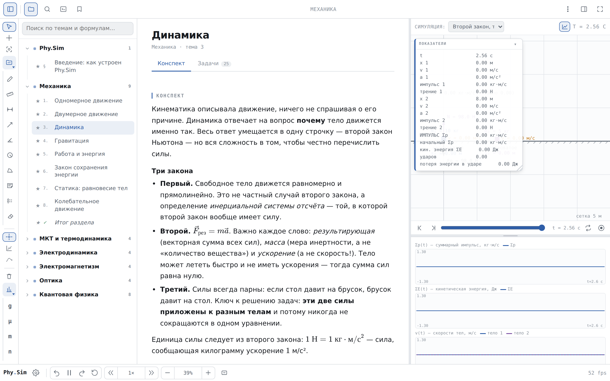
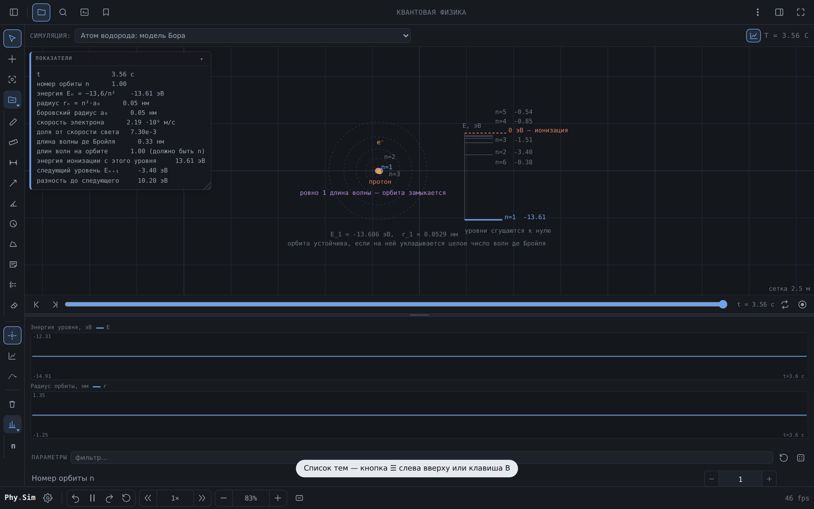
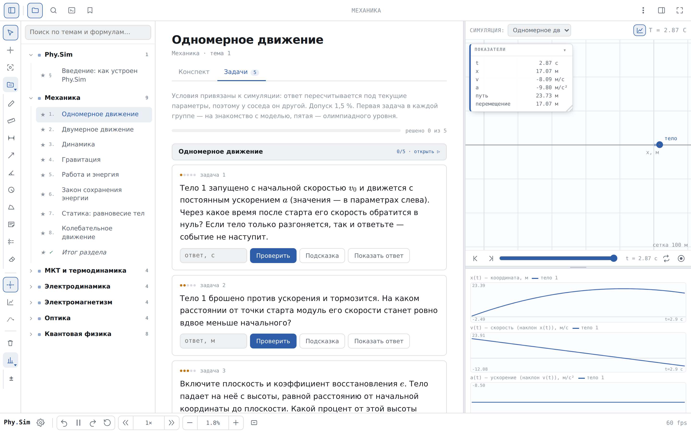
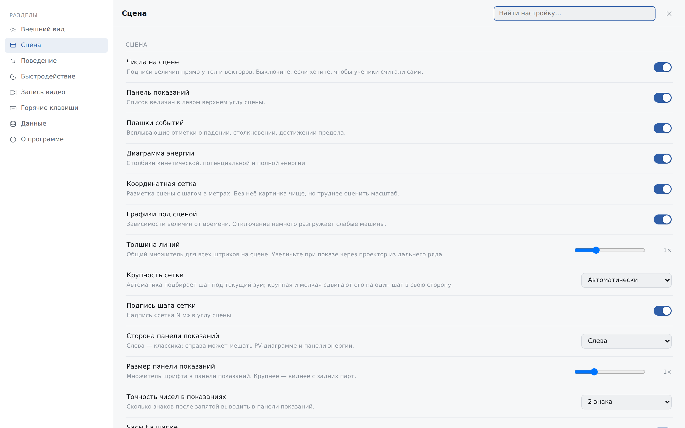
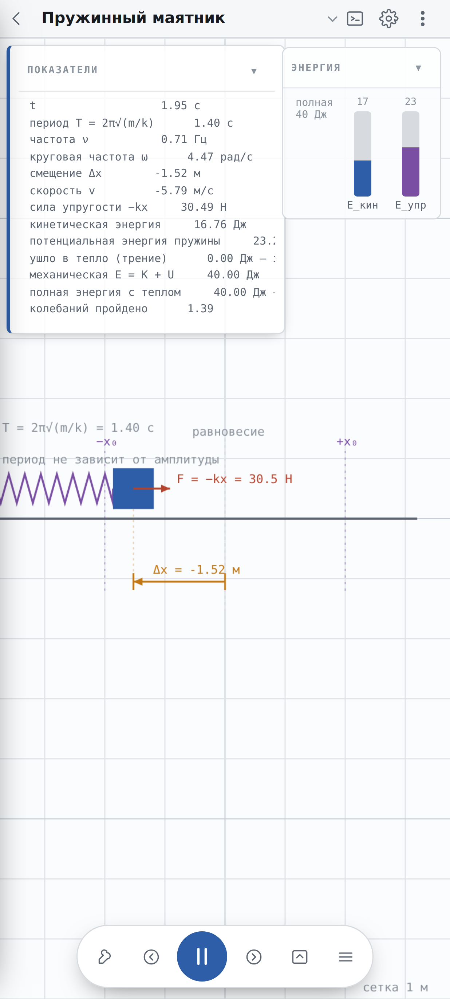
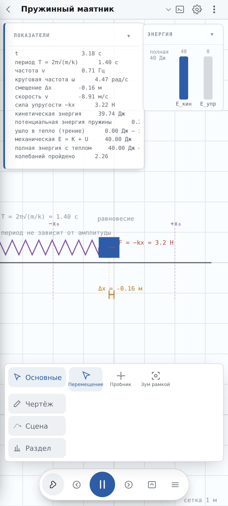

# Phy.Sim

**An interactive physics textbook where every formula has a live simulation next to it.**

Read the theory, change the numbers, watch what happens. 76 simulations, 380 problems
and the whole course from kinematics to quarks — in a single HTML file that runs
offline, with no install and no account.

> The course content is in **Russian** (it follows J. Orear's *Physics*, vols. 1–2).
> The code, build scripts and this document are in English.

### Must read

This application was developed by the creator Somi together with Claude. The AI
assistant wrote practically all of the course notes on its own; the only places I
stepped in were the introduction and a few other topics. The mobile adaptation and
the entire architecture of this project were likewise built by Claude, and may well
contain plenty of bugs. [Bug reports](../../issues) are welcome.

<p align="center">
  
</p>

---

## Demo


https://github.com/user-attachments/assets/efd65eac-32d3-40f8-8381-c8aeccb81596


<!-- TRAILER: upload the video file straight into this README on GitHub
     (edit the file → drag & drop the .mp4 → GitHub inserts a
     https://github.com/user-attachments/assets/... link) and replace the
     poster line below with that link. GitHub renders it as a player. -->

<p align="center">
  <a href="docs/media/03-simulation-dark.png">
    
  </a>
</p>

---

## Download

**[→ Get the latest build](../../releases/latest)** — pick the file for your system,
double-click it, done. No console, no toolchain, nothing to compile.

| System | File | What happens |
|---|---|---|
| **Windows 10/11** | `Phy.Sim-Setup-1.1.0.exe` | A normal setup wizard: a notice about how the course was written, your choice of folder, tick boxes for a Desktop and a Start-menu shortcut, then *Run Phy.Sim* or *Finish*. No admin rights required. |
| **Windows, no install** | `Phy.Sim-portable-1.1.0.exe` | Runs straight from a flash drive. Nothing is written to the system. |
| **Fedora** | `Phy.Sim-1.1.0.x86_64.rpm` | Double-click → *Software Install*, or `sudo dnf install ./Phy.Sim-1.1.0.x86_64.rpm`. Adds Phy.Sim to the applications menu. Fedora is the only Linux distribution this package is built and tested for. |
| **Android** | `phy-sim.apk` | Allow installing from your browser, then open the file. Asks for zero permissions. |
| **Anything else** | [`phy-sim-standalone.html`](phy-sim-standalone.html) | One file, 2.6 MB. Open it in any browser — phone, tablet, school computer. Works offline. |

> The installers are attached to the release rather than committed to the
> repository: each one is ~80 MB, and a git repository keeps every copy of every
> file forever. The **Code** tab holds the source; the **Releases** page holds the
> ready-made builds.

Running from source needs nothing at all: `git clone` → open `index.html`.
No build step, no dependencies, no sign-in, no telemetry, no network requests —
KaTeX and its fonts ship inside the repository.

---

## What's inside

|  |  |
|---|---|
| **76** interactive simulations | mechanics · thermodynamics · electricity · magnetism · waves & optics · quantum · nuclear |
| **34** topics in **7** sections | full lecture notes, written to be read, not skimmed |
| **252** key formulas | each one opens the simulation that shows it working |
| **380** problems | five per simulation: one to get oriented, three to think about, one olympiad-grade |
| **133** common mistakes | the wrong idea, the right one, and why the wrong one is tempting |
| **125** cross-links | the same idea traced across mechanics, thermodynamics and quantum physics |
| **56** settings | theme, density, scene decorations, performance, recording |
| **printable tests** | any number of variants, each with its own numbers, plus an answer key |

### Problems that can't be looked up

Most answers are computed from the **current parameters of the linked simulation**.
Change the mass and the answer changes — so your neighbour's answer is different.
An audit (`npm run audit`) runs all 380 problems against 40 randomised parameter
sets each and checks that none of them throws, returns a non-number, is unanswerable
for every input, compares a switch against a value the simulation doesn't have, or —
above level 1 — simply equals a number already shown in the readouts panel.

It also reports — as information, not as errors — the 82 problems whose answer is
deliberately parameter-independent (the conceptual ones: "how much work does the
tension do over one revolution?" — always zero), the level-1 problems that *are*
meant to be answered by reading the panel, and every answer that is proportional to
a single parameter, so its unit can be checked against that parameter's. Worth
knowing when you set homework.

### Every simulation checked against the textbook

`npm run physics` is a separate harness: **504 checks** that take a simulation's
readouts and compare them with a number computed from the closed-form solution,
written out independently of the simulation's own code. Parameters are deliberately
un-round (a wrong coefficient hides behind a nice number), the reference constants
are listed separately from the ones the simulations use, and every check carries a
justified tolerance — `1e-9` for algebra, looser where a numerical integral or a
finite number of molecules is involved.

Conservation laws are checked as *behaviour*, not as formulas: the harness records
the readouts frame by frame and looks at how far a conserved quantity drifts over
the whole run, and separately at whether it ever **grows** where it must only decay
(mechanical energy under friction, kinetic energy in an inelastic collision).

<p align="center">
  
</p>

### A real instrument, not a slideshow

Pan, zoom, box-zoom, coordinate probe, ruler, dimension line, protractor, circle,
polygon area, notes, guides, body trails and a freehand pencil. Every drawing tool
carries its own colour, thickness and — for guides and dimension lines — a dashed
or solid stroke; each mark keeps the style it was drawn with, so changing the
colour never repaints what is already on the scene. Parameter fields accept
expressions (`2*9.8`). A timeline scrubs the computed history frame by frame.
Panels float, resize and collapse. `Ctrl+P` opens a command palette over
everything — topics, simulations, settings, commands. `F11` cycles the window
mode: windowed → fullscreen → borderless fullscreen.

<p align="center">
  
  
</p>

### For teachers: a test where copying doesn't help

**Menu → Собрать контрольную**, or `Ctrl+P` → "контрольная". Pick the topics, the
difficulty levels, how many variants and how many problems each, and the app
prints a paper test.

Every variant gets **its own parameters for the linked simulations**, so every
variant has different answers. The numbers are printed into the problem itself —
the app works out which parameters actually affect the answer and lists only
those. A separate answer key comes at the end, and only `Ctrl+P` on that page
puts it on paper: the rest of the interface never prints.

The variant seed is on the dialog. The same seed always produces the same test,
so you can reprint a lost sheet, or mark work against a key printed weeks later.

### Built for a phone, not shrunk onto one

A separate layout: a 35 px header, notes as plain text, a drawer for topics, a
floating control bar and a parameter sheet. Tools open as folders. Sizes come from
the *visual* viewport, so the browser's address bar never covers anything.

<p align="center">
  
  
</p>

---

## Build the apps

Both wrappers hold the same source — there is no separate mobile or desktop version.

### Android `.apk` — no Android Studio, no SDK

```bash
npm run build:apk        # → packaging/android/out/phy-sim.apk  (1.2 MB)
```

Needs only a JDK, `curl`, `zip` and `unzip`. The missing pieces (`aapt2`,
`android.jar`, the dexer) are fetched from Maven Central on first run. The app asks
for **zero permissions** and never touches the network.

### Windows `.exe`

```bash
cd packaging/windows && npm install && npm run dist
```

Produces an NSIS installer (no admin rights needed) and a portable `.exe` that runs
straight off a flash drive. On Windows you can just double-click
`packaging\windows\build-exe.bat`. Cross-building from Linux works too — see
[packaging/README.md](packaging/README.md) for the Wine setup.

The installer's first page is [`notice.txt`](packaging/windows/notice.txt) — the
statement about how the course was written. The shortcut checkboxes live in
[`installer.nsh`](packaging/windows/installer.nsh).

### Fedora `.rpm`

```bash
cd packaging/windows && npm install && npm run dist:fedora
```

Needs `rpmbuild` on the build machine. Installs into `/opt/Phy.Sim` and adds a
desktop entry. Other distributions are not packaged — use the standalone HTML file.

### Everything at once

Push a tag and GitHub Actions builds all four and attaches them to a release:

```bash
git tag v1.0.0 && git push origin v1.0.0
```

### Single file

```bash
npm run build            # → phy-sim-standalone.html
```

Everything — styles, scripts, KaTeX, fonts — inlined into one HTML file you can
email, put on a flash drive, or open by double-clicking.

---

## Project layout

```
index.html            markup and script order — this is the dependency graph
tests/regress.js      pre-release suite: every simulation, formulas, layout
tests/physics.mjs     504 checks of readouts against closed-form solutions
tests/answers.mjs     all 380 problems against 40 random parameter sets each
css/style.css         all styles: light/dark themes, desktop and phone layouts
js/core.js            helpers and the empty SIMS registry
js/sims/*.js          the 76 simulations, grouped by branch of physics
js/topics.js          course content: notes, formulas, mistakes, links, problems
js/app.js             the core: state, canvases, render loop, the entire UI
vendor/katex/         KaTeX + fonts, so formulas render without a network
build-standalone.mjs  bundles everything into one HTML file
packaging/            Android and Windows wrappers, icon source
docs/ARCHITECTURE.md  contracts and design decisions (in Russian, like the code comments)
```

Plain `<script defer>` tags sharing one global scope — deliberately. ES modules
don't work over `file://`, and the whole point is that `index.html` opens by
double-clicking on any school computer.

**Adding a simulation** means adding one object to the `SIMS` registry with
`init` / `step` / `draw` / `fit`. See [docs/ARCHITECTURE.md](docs/ARCHITECTURE.md)
for the full contract.

**Before releasing**, run all three suites. `npm test` boots both the source and the
bundled single file, runs 300 steps of every simulation, checks that no formula
overflows its column, and walks the desktop and phone layouts. `npm run physics`
compares the simulations with the textbook. `npm run audit` checks the problems.

```bash
npm i -D playwright
npm test && npm run physics && npm run audit
```

---

## License

[GPL-3.0](LICENSE). Free to use, study, change and share — including in class.
