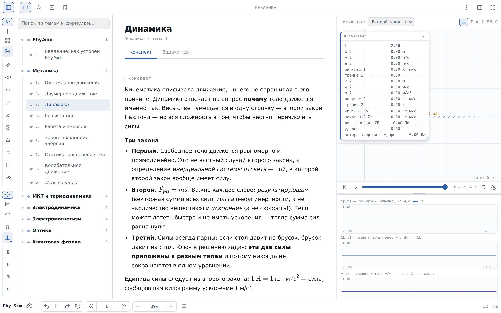
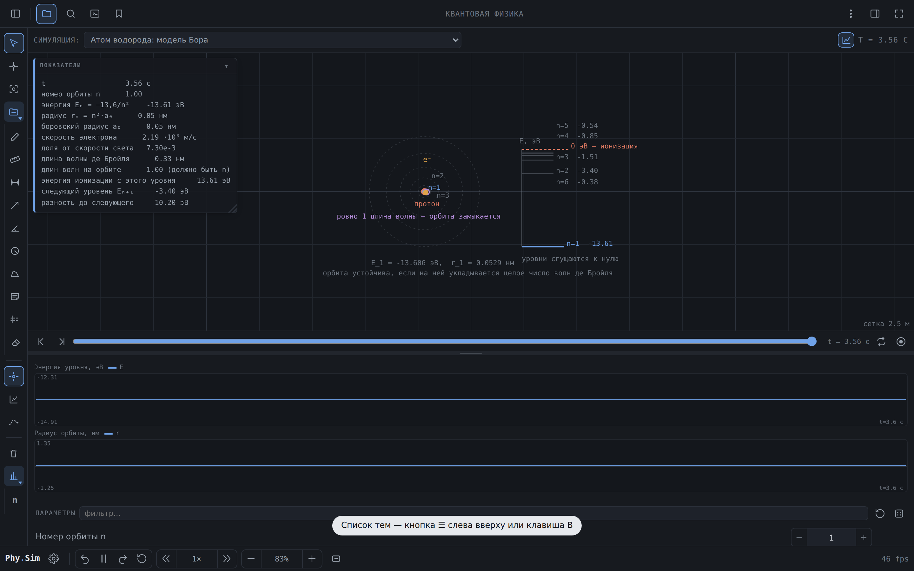
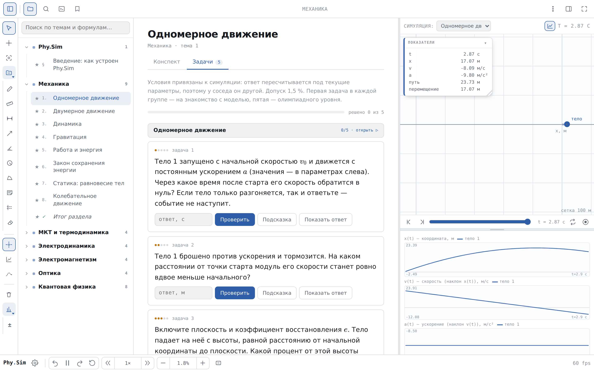
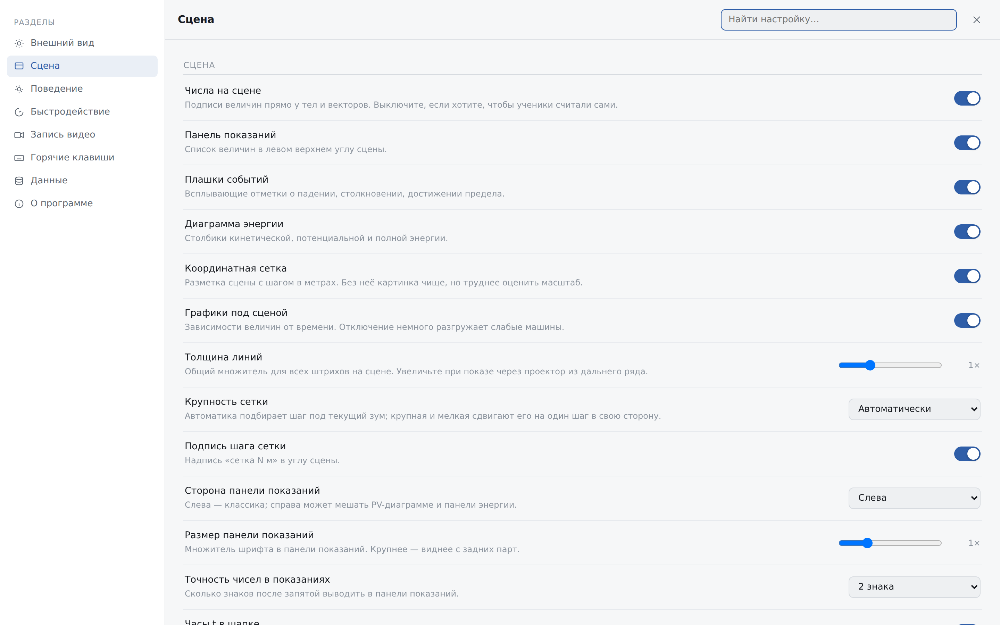
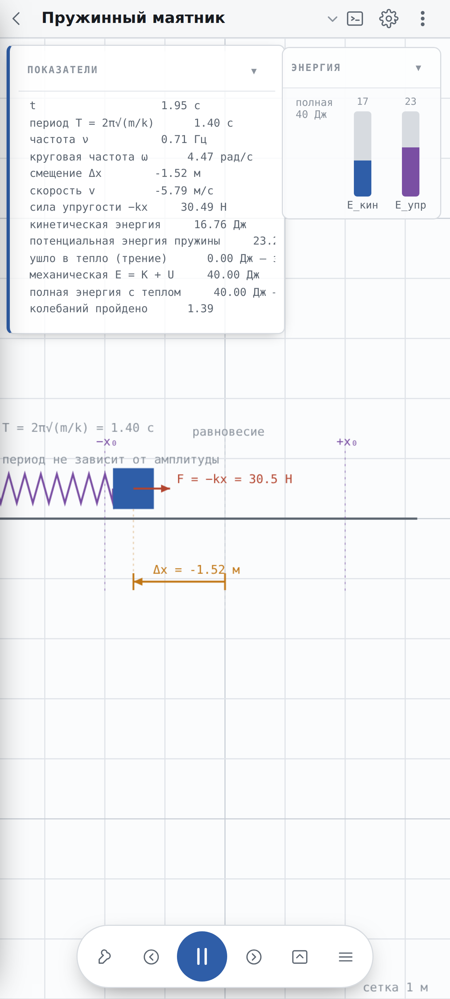
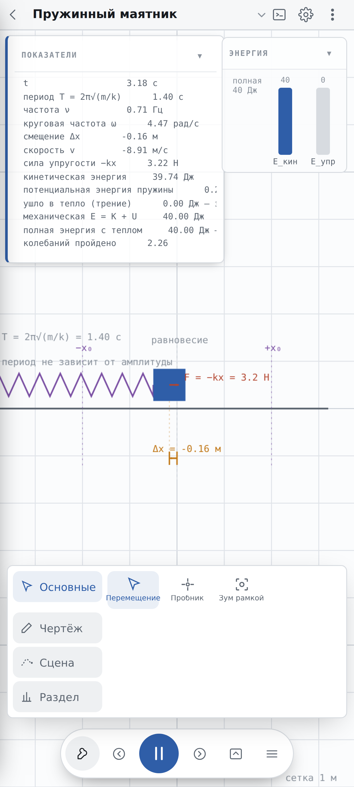

# Phy.Sim

**A physics course you revise by running it.** The simulation comes first; the notes
are what you read when the simulation surprises you.

This is not a course that teaches physics from zero — it is a **full revision** of one,
from kinematics to quarks. Every topic opens with three things to try in a live
simulation, five points worth remembering, and the derivations behind the formulas.
114 simulations, 135 derivations and 562 problems, in a single HTML file that runs
offline, with no install and no account.

> The course content is in **Russian** (it follows J. Orear's *Physics*, vols. 1–2).
> The code, build scripts and this document are in English.

### Must read

This application was developed by the creator Somi together with Claude. The AI
assistant wrote practically all of the course notes on its own; the only places I
stepped in were the introduction and a few other topics. The mobile adaptation and
the entire architecture of this project were likewise built by Claude, and may well
contain plenty of bugs. [Bug reports](../../issues) are welcome.

<p align="center">
  
</p>

---

## Demo


https://github.com/user-attachments/assets/efd65eac-32d3-40f8-8381-c8aeccb81596


<!-- TRAILER: upload the video file straight into this README on GitHub
     (edit the file → drag & drop the .mp4 → GitHub inserts a
     https://github.com/user-attachments/assets/... link) and replace the
     poster line below with that link. GitHub renders it as a player. -->

<p align="center">
  <a href="docs/media/03-simulation-dark.png">
    
  </a>
</p>

---

## Download

**[→ Get the latest build](../../releases/latest)** — pick the file for your system,
double-click it, done. No console, no toolchain, nothing to compile.

| System | File | What happens |
|---|---|---|
| **Windows 10/11** | `Phy.Sim-Setup-7.0.0.exe` | A normal setup wizard: a notice about how the course was written, your choice of folder, tick boxes for a Desktop and a Start-menu shortcut, then *Run Phy.Sim* or *Finish*. No admin rights required. |
| **Windows, no install** | `Phy.Sim-portable-7.0.0.exe` | Runs straight from a flash drive. Nothing is written to the system. |
| **Fedora** | `Phy.Sim-7.0.0.x86_64.rpm` | Double-click → *Software Install*, or `sudo dnf install ./Phy.Sim-7.0.0.x86_64.rpm`. Adds Phy.Sim to the applications menu. Fedora is the only Linux distribution this package is built and tested for. |
| **Android** | `phy-sim.apk` | Allow installing from your browser, then open the file. Asks for zero permissions, needs no Google services, and is signed with APK signature schemes v1, v2 and v3 so modern Android installs it without complaint. |
| **Any phone, no app store** | *open the web app → «Install»* | Works where an `.apk` cannot: Google services blocked, a vendor installer that refuses unknown sources, or an iPhone. The browser offers **Install**, you get a home-screen icon, no address bar, and it keeps working offline. |
| **Anything else** | [`phy-sim-standalone.html`](phy-sim-standalone.html) | One file, 3.6 MB. Open it in any browser — phone, tablet, school computer. Works offline. |

> The installers are attached to the release rather than committed to the
> repository: each one is ~80 MB, and a git repository keeps every copy of every
> file forever. The **Code** tab holds the source; the **Releases** page holds the
> ready-made builds.

### Installing without an app store

The repository ships `manifest.webmanifest` and `sw.js`, so the page served over
HTTPS is an installable web app. The `Publish web app` workflow puts it on GitHub
Pages; the owner enables it once under **Settings → Pages → Source: GitHub
Actions**. After that the address is `https://<owner>.github.io/<repo>/` — open it
on a phone and use *Install app* (Chrome) or *Share → Add to Home Screen*
(Safari). Everything is cached on first visit, so it opens with no network
afterwards.

Running from source needs nothing at all: `git clone` → open `index.html`.
No build step, no dependencies, no sign-in, no telemetry, no network requests —
KaTeX and its fonts ship inside the repository.

---

## What's inside

|  |  |
|---|---|
| **My path** | the handbook remembers what you solved and when: a map of all topics and what each stands on, a 12-problem diagnostic, spaced review, and a trainer for the skill behind your mistakes |
| **why the answer is wrong** | a wrong answer is checked against the answers that typical slips produce — sin for cos, degrees in radian mode, centimetres left unconverted, forgotten friction, a lost sign — and the slip is named |
| **76** questions to start from | "why doesn't a satellite fall?" — each opens the topic and the simulation where you can see the answer |
| **114** interactive simulations | mechanics · thermodynamics · electricity · magnetism · alternating current · waves & optics · relativity · quantum · nuclear |
| **circuit constructor** | draw wires, resistors and capacitors on a grid; node potentials, Kirchhoff's laws, equivalent capacitance and stored charge are solved live |
| **honest axes** | numbered axes only where one grid square really is one metre — never on schematics, PV-diagrams or spectra |
| **51** topics in **8** sections | each one opens with what to try, then five points to remember; the full notes are one click below, collapsed |
| **166** things to try | "change this — watch that": the experiment that makes the point, named before any theory |
| **220** points to remember | the five sentences per topic you would want on an exam morning |
| **135** derivations, **496** steps | every step revealed one at a time, each with the reason it is allowed — a formula you watched being built is not a formula you memorised |
| **calculator with units** | 72 км/ч в м/с, (2,5 ± 0,1) м / (3,0 ± 0,2) с, h c / (500 нм) в эВ — every number carries its dimension, adding metres to seconds is refused, uncertainty propagates |
| **311** course formulas, solvable | any of them for any of its quantities: T = 2π√(L/g) solved for g, with units and uncertainty; the rearranged formula is shown, not just the number |
| **40** math techniques, on the steps | every step is tagged with the mathematics it uses; a tag opens what the technique is, when it is legitimate, where it breaks — and every other derivation in the course that uses it |
| **prerequisites, stated** | a topic names what you must know first and offers a one-minute check before you start reading |
| **399** key formulas | each labelled *law*, *definition* or *consequence*, and each opens the simulation that shows it working |
| **562** problems | five per simulation: one to get oriented, three to think about, one olympiad-grade |
| **129** interesting facts | three per topic at the end of the notes: where the physics shows up in life, how it was discovered, what surprises in it |
| **university level** | a «School / University» switch adds sections with vectors, derivatives, integrals and Maxwell's equations; 37 topics so far — from mechanics to particle physics — more being added |
| **134** self-checks | three questions per topic, answers hidden until you have tried |
| **179** cross-links | the same idea traced across mechanics, thermodynamics and quantum physics |
| **147** glossary terms | short definitions, in search and in the *More* menu; optionally the first mention in the notes is underlined |
| **reference sheet** | symbols, constants, units and the 40 techniques in Settings — the thing you would otherwise keep a browser tab open for |
| **86** settings, profiles | 8 themes, any accent colour, corners, fonts, column width, line spacing, animation level, button style; save your own profile and pass it on as a short code |
| **lab** | take noisy readings, straighten the axes (T² against L), fit a least-squares line with its uncertainties, export a CSV |
| **printable tests** | any number of variants, each with its own numbers, plus an answer key |

### New in 7.0: the scene in the middle; a ripple tank; waves, optics and modern physics

- **A new desktop layout.** The simulation now fills the window. Topics drop down from
  «Section › Topic ▾» at the top and close once you pick one; the notes and problems slide in
  from the right and push the scene aside instead of covering it; playback is a player-style
  console under the scene (timeline on top; tools, steps, play, speed, zoom below); parameters
  and graphs sit in a card at the right edge that closes with ×; the drawing tools fan out
  above the pencil. Nothing was lost — every button moved, none was removed. The old
  column layout stays one setting away (*Settings → Look → Desktop layout*). The phone layout,
  drawn by the author, is unchanged.
- **The home screen is a ripple tank.** Two point sources in phase; the bright bands between
  the hyperbolic nodal lines carry running crests, the nodal lines stay calm. Touching the
  water drops a third source that changes the pattern and dies away.
- **Three new topics**: «Mechanical waves and sound», «Thermal radiation and photometry» and
  «Nuclear reactions and energy».
- **Twelve new simulations**: a sound wave (layers of air, pressure, an oscillogram, beats and
  intervals), a resonating pipe (open and closed), Fresnel zones with the Poisson spot and a
  zone plate, polarisers and Brewster's angle, a spherical mirror with ray construction,
  Planck's spectrum with the body's colour, a lamp over a table and a photometer, relativistic
  acceleration by a constant force, Rutherford scattering with an angular counter, a chain
  reaction with critical size and control rods, shielding and dose for α, β and γ, and a
  cloud chamber in a magnetic field.
- **Notes** from the two remaining books: sound and hearing, Huygens and Fresnel zones,
  birefringence, the eye and optical instruments, radio, relativistic Doppler, luminescence,
  molecular spectra, the discovery of the nucleus, detectors, gluons and confinement,
  reactors, fusion and what to do in a radiation emergency. University sections for eleven
  more topics — 37 in all.

### New in 6.4: one simulation — one topic; solids, circuits, machines, three-phase current

- **No simulation appears in two topics any more.** Magnetism, radiation pressure, the rocket,
  buoyancy, Bernoulli and a few scenes added in 6.3 used to open from two or three places. Each
  now lives in exactly one topic; a curriculum test fails if a scene is ever shared again.
- **Three new topics**: «Solids: elasticity and thermal expansion», «Circuits and measurements»
  (Kirchhoff, the Wheatstone bridge, shunts and multipliers) and «Three-phase current».
- **Nine new simulations**: capillary rise (Jurin's law, mercury goes down); a rod stretched to
  rupture or clamped and heated; the Otto and Diesel cycles with work and heat per stroke; drift of
  electrons in a wire and R(t); a p–n diode and a vacuum diode (Shockley, Child–Langmuir,
  Richardson); a Wheatstone bridge, ammeter and voltmeter; a damped LC circuit next to a spring;
  a DC motor with back-EMF; three-phase star/delta with the rotating field.
- **Notes**: Stern's experiment and the Boltzmann distribution, Poisson's equation, the third law,
  phase diagrams and humidity meters, chemical cells, plasma, transistors, the eddy field, DC
  machines, magnetic recording, H and ferromagnets, parallel resonance and the Q-factor,
  self-oscillators. University sections for six more topics.

### New in 6.3: real gases, transport, current in media; two fixes

- **Three new topics.** «Real gas, vapour and liquid»: the van der Waals equation, saturated
  vapour, the critical point, boiling, humidity, surface tension. «Transport phenomena»: mean
  free path, diffusion and Brownian motion, heat conduction, viscosity of a gas, radiation.
  «Current in different media»: metals, electrolytes and Faraday's law, gases, vacuum,
  semiconductors.
- **Five new simulations**: van der Waals isotherms with Maxwell's equal areas and a piston
  under which liquid appears; a rod that cools and warms (copper against glass); Brownian motion
  checked against Einstein's formula; an electron beam deflected by capacitor plates; electrolysis.
- **University level for thermodynamics and electricity**: Mayer, the adiabat and the polytrope,
  entropy and Boltzmann's formula, thermodynamic potentials, Clapeyron–Clausius, critical
  exponents, the diffusion equation and Einstein's relation, Gauss and Poisson in differential
  form, multipoles, the method of images, D and polarisation, Ohm's law j = σE and the Drude
  model, continuity, Child–Langmuir, intrinsic carriers.
- **Section icons** are plain coloured squares and dots until the author draws real logos.
- **Fixes**: the energy diagram in «Work and energy» can be hidden (its checkbox did nothing,
  and the panel now has ×); switching School / University no longer throws you out of full screen.

### New in 6.2: a soap film, momentum and fluids, university-level mechanics

- **The home screen is a soap film.** Its colours are not picked by hand — they are computed:
  the reflection spectrum of a water film of thickness *d*, sin²(2πnd/λ), is folded with the CIE
  colour-matching functions and turned into sRGB. The top of the film has drained to a few tens
  of nanometres and is black, below it come silver, gold, magenta and blue — the orders of
  interference. The film swirls; a finger stirs it and presses rings into it. In the light theme
  you see it in transmitted light: pale complementary colours.
- **New topic «Momentum. Jet propulsion»** with a new simulation: one ball hits a hard wall and a
  soft mat at the same time. The force curves differ a hundredfold in shape, but the areas under
  them — the impulse — are equal.
- **New topic «Fluid mechanics»**: pressure at depth, Pascal, Archimedes and floating, continuity,
  Bernoulli, Torricelli, viscosity, Stokes and the Reynolds number, lift and the Magnus effect.
  Two new simulations — a vessel draining through one or three holes, and a ball falling through
  glycerin, oil, honey or water.
- **Chapters added along the classic textbook plan**: jerk, angular kinematics, inertial forces
  and overload, the parallel-axis theorem, self-sustained oscillations.
- **University level for all of mechanics** (the School / University switch): polar coordinates
  and curvature, Gauss's law for gravity and the effective potential, Meshchersky's equation and
  reduced mass, F = −∇U and stability, the centre-of-mass frame and threshold energy, Euler's
  equation and Poiseuille, the equation of moments, Euler's equations and precession, damping,
  Q-factor, forced and parametric resonance, the Coriolis force.

### New in 6.1: a light home screen, real thermodynamics, links to experiments

- **The home screen follows the theme**: warm paper in the light theme, ink in the dark one.
- **Thermodynamics you can see**: the left wall is hot, the right one cold. Molecules leave each
  wall with its temperature, and a temperature gradient settles in the gas — heat flows from hot
  to cold right on the screen. In the corner, the distribution of molecules by speed fills up
  live and is drawn against Maxwell's curve.
- **Section icons**: minimal one-colour lines in the colour of the section — no dark tiles.
- **A link to this experiment**: *More → Link to this experiment* copies an address with the
  simulation and every parameter you changed; whoever opens it gets the same setup.
- **Full-screen simulation** always takes the whole width, even after the splitter was dragged.

### New in 6.0: the phone redesigned from a sketch, a gas on the home screen

- **The simulation screen on a phone**, drawn by the author: at the top — notes, the
  simulation name in a visible box (tap to switch), parameters, ⋮. At the bottom — the time
  bar, readouts and one row of buttons: undo, redo, speed, play/stop (stop only pauses), reset,
  a pencil for tools, more. Nothing slides up over the scene any more.
- **Notes and problems** open as their own page; **parameters and graphs** — as a full-screen
  page with two tabs and a slider under every number.
- **Settings in one place** — the gear at the bottom of the topic list; the extra entries in the
  simulation header and panels are gone.
- **A new splash**: the Φ logo draws itself — the orbit, the axis, the particle's turn.
- **Home screen**: an ideal gas instead of the field — hundreds of molecules colliding, coloured
  by speed; your finger warms the gas. The problem of the day and the diagnostics card lie right
  in the gas: molecules bounce off them and they tremble slightly (Brownian motion). The slogan:
  «Не смог представить? Сейчас исправим.»
- **Section logos**: a throw, gas in a box, a dipole, a wave through a loop, a lens, a light cone,
  a wave packet. New icons for the course and for the tools; no separate «Home» tab — the logo
  leads there.
- **Interesting facts** replace common mistakes at the end of every topic (the mistakes still
  drive the analysis of a wrong answer to a problem).
- **School / University**: a switch in the topic header adds a university-level section —
  kinematics with the radius vector, Newton's laws through momentum and Tsiolkovsky's formula,
  the nonlinear pendulum and deterministic chaos, the Maxwell distribution, Maxwell's equations
  and the speed of light.

### New in 5.1: a remote for the phone, and a logo

- **The remote.** On a phone, under the scene, every parameter is a chip with its value. Pick a
  chip and a ruler appears: drag it with your thumb and the scene recomputes as you go — no
  sheet over the picture, no tiny − and + buttons. Ticks give a short buzz on the way and a firmer
  one at the end of the range (can be switched off). A switch flips with one tap, a list becomes
  a row of buttons, the value itself opens a field for an exact number. Changed parameters carry
  a dot.
- **Simpler transport.** One row: play, reset, speed (tap to cycle 0.25×…8×), more. Double-tap
  the scene to fit it to the frame. The full parameter list gets a slider under every number.
- **A logo.** The letter Φ built from a model: a tilted orbit, an axis and a particle; the lower
  arc passes in front of the axis, the upper one behind it. App icons, the tab icon, the top bar
  and the phone header all use it.
- **Sections without animations.** Large section number in its colour, a fine line icon, the
  first topics — and nothing moving.
- **The field responds.** On the home screen your finger or cursor becomes a charge: the field
  rebuilds around it and the particles stream into it.

### New in 5.0: a clean sheet

The biggest redesign so far — and most of it is taking things away.

- **Own typefaces, offline.** Inter for text, Inter Tight for headings, JetBrains Mono for
  numbers — bundled with the app, no network needed.
- **A home screen that moves.** A full-width live electric field: four charges drift and a
  thousand particles flow along their field lines. One line of text over it — the topic you
  stopped at, or where to start — and the search. Each section has its own small live picture:
  a throw, gas in a box, a dipole, a wave, a lens, a light cone, an orbital.
- **Quieter topics.** No boxes around the introduction, the experiments or the formulas; the
  only tinted block is *Key points*. The header is the title and one line: section, topic
  number, reading time.
- **Less on the phone.** Five buttons in the top bar instead of seven; readouts only on the
  *Parameters* tab; flat tabs.
- **Removed:** reading aloud, "predict first", the lesson and read-aloud buttons over the notes,
  the activity diary, the question-of-the-day and tools blocks on the home screen, repeated
  "Phy.Sim" labels, explanatory captions nobody needed. Lesson mode and the glossary stay — in
  the *More* menu and in search; underlining glossary terms is now an opt-in setting.

### New in 3.5: a phone layout that leaves room for the scene, optics redone

- **Phone.** The bottom of the sheet is one row now — play, reset, undo and speed — and the rarely
  used buttons (zoom, fit, redo, menu, settings) live in a "⋯" card above it. On a phone held
  sideways the transport bar used to stand up as a column across the whole screen and hide the
  scene; now transport and the timeline share one row. Readouts are cards with two-line labels.
  The 88-pixel strip above the notes shows a window onto the moving bodies instead of a random
  crop with piled-up captions.
- **Optics, reviewed end to end.** Refraction shows wavefronts in the colour of the light, bunching
  up in the denser medium; the refractive index now depends on wavelength (violet bends more than
  red), and reflected and transmitted rays are as bright as the Fresnel formulas say. Total internal
  reflection: the ray escaping a fibre was drawn at the wrong angle. Lens: F is the front focus and
  F′ the back one, as in textbooks, and the third ray works for a diverging lens too. Optical bench:
  telescopes look at a distant object, with the angular magnification −F₁/F₂. Young's experiment and
  the grating show the wave field itself — bright and dark beams — and fringes in the colour of the
  light. The ionosphere scene has the angle of the beam and the secant law f < fp/sin β. Every optics
  scene puts its conclusions in a caption under the picture instead of over it. In the notes:
  the secant law, Fresnel losses, the half-wave in thin films; refraction problems no longer treat
  diamond as glass.
- **Finite rotations, many of them.** Up to 100 moves, in three orders (alternating, a random sequence
  and its reverse, a random shuffle), with a plot of how far the two books have drifted after each
  move. At 90° the drift goes 0 → 120° → 120° → 0 and both books are back home after six moves.

### New in 3.4: scenes that stay readable

- **Vector arrows are drawn, not left to the font.** Labels such as F⃗, v⃗ = ω⃗ × r⃗ or dφ⃗ used a
  combining arrow that most fonts put beside the letter or drop altogether. The arrow is now drawn
  over the letter everywhere: on the scene, in the readouts, in parameter names and presets.
- **Five scenes rebuilt as panels.** Quarks (with a live picture of confinement: pull a quark and the
  gluon tube snaps into a new quark–antiquark pair), radioactive decay (the particle flies out, freshly
  decayed nuclei flash), neutron beta decay, the nucleus with a map of stability, and band theory.
  Their labels were pixel offsets from one point and piled up in a narrow window; now every caption
  lives inside its own frame, long lines wrap, and text shrinks a little with the picture.
- **The picture avoids the panels.** "Fit to view" used to know only about the readouts panel. It now
  finds the largest free rectangle between all floating panels — readouts, energy, PV diagram,
  distribution — so the heat-engine cylinder no longer sits under the PV diagram. The force legend
  picks a free corner.
- **A compact readouts panel.** It shows the first six rows (4, 6, 10 or all, in Settings) with
  "▾ N more". Words that old scenes stored as units ("0.00 the particle should not pass") are now
  shown as words; whole numbers have no ".00"; scene numbers read 1.7·10⁴, not 1.7e+4.
- **Fixes.** Bohr, Pauli, Compton, the wave packet, the particle in a box, the X-ray tube, binding
  energy, micro- and macrostates, the heat engines, heating curves, the rigid-body scene and the
  wave had overlapping captions; the spring's wall was outside the frame; the Carnot scene did not fit
  at all in a narrow window. Four formulas in the notes had a raw "<" that broke their rendering.

### New in 3.3: 3D that is right-handed, a laser you can follow

- **3D where it helps.** Minkowski's diagram now opens in 2+1 dimensions: the light cone is a real
  cone, the light from a flash grows as a circle on the Earth's "now" plane, and the rocket's "now" is
  a second plane tilted only along its motion. The electromagnetic wave shows E and B in perpendicular
  planes. A charge in a magnetic field with a velocity component along B draws a helix with pitch
  h = v∥T. The field of a straight wire is a stack of rings. The bond-types scene shows rock salt,
  diamond's tetrahedra, copper's face-centred cube and a molecular crystal as lattices you can turn.
- **The 3D projection is no longer a mirror image.** It was left-handed, so the right-hand rule on
  screen looked like the left-hand one. Now x is right, z is up and y goes into the screen. Dragging up
  or down is inverted by default; there are separate settings for both drag directions.
- **Photons drawn once, well.** One photon glyph for every scene: a smooth wave with a fading tail
  and an arrowhead, in place of hand-made squiggles sampled six points per wavelength.
- **The laser, explained.** "Avalanche": a photon runs along a row of excited atoms and gathers
  identical copies, while in a row of unexcited atoms it is simply absorbed. "Whole laser": atoms are
  drawn as two-rung ladders with the electron on one rung, photons bounce between the mirrors and leak
  out as the beam.
- **Fixes.** Annihilation trails were invisible and the gamma rays flew straight through the detector
  ring. Special relativity scenes were hidden under the readouts panel. In the Lorentz-force scene the
  field was marked "into the screen" while the charge turned the way a field out of the screen would
  turn it. The rigid-body scene is now listed under *Rigid body: equilibrium and rotation* and under 2D
  motion. The notes gained a light-cone section, the water-trough picture of a particle in a box and
  packet spreading. Two problems whose answers could be read off the readouts panel were reworded.

### New in 3.2: motion in space, quantum scenes that move, the laser

- **Mechanics gets a third axis.** A projectile can now be thrown at an azimuth as well as an
  elevation: the scene turns into a rotatable 3D view with a ground grid, the trajectory, its
  shadow and the three velocity components; a side wind along z bends the shadow into a
  parabola. A new scene, *rigid-body rotation*, explains the **vector of an elementary rotation
  angle** dφ⃗: a rod spins about a tilted axis, the swept sector is dφ, the arrows ω⃗ and dφ⃗
  sit on the axis by the right-hand rule, and v⃗ = ω⃗ × r⃗ is drawn at the tip. A second
  experiment turns two books by 90° about x and y in opposite orders — they end up 120° apart,
  which is why a finite rotation is not a vector. New notes, a derivation of v = ω × r and five
  problems in *Statics*. The conical pendulum is flat again.
- **Quantum scenes redrawn so that something happens in them.** Compton: a photon packet hits
  a resting electron and leaves with a longer wavelength, next to an energy balance and the
  momentum triangle p⃗ = p⃗′ + p⃗ₑ. De Broglie: electrons cross a crystal one at a time and
  pile up into fringes, with λ drawn beside the lattice spacing at the same scale. The wave
  packet now **spreads** by the exact free-particle formula — narrow packets spread fast because
  their momentum spread is wide — with Δx(t) on a graph. The particle in a box is **water in a
  trough**: a travelling wave and its reflection add up to a standing wave, in 3D you can turn;
  a mix of two levels sloshes from wall to wall. The hydrogen spectrum sends each photon to its
  line on a log-scale spectrum and shows what a spectroscope shows (bright lines, or dark ones
  in absorption). The X-ray tube fires electrons into the anode, and the spectrum builds up
  photon by photon — bremsstrahlung under its theoretical curve, Kα and Kβ peaks — while the
  atom beside it shows a K electron knocked out and an L electron dropping in.
- **Matter and nuclei.** Bond types show close up how each bond forms (an electron jumps, is
  shared, spreads through the metal, or stays put) with a comparison of all four. Free electrons
  race at up to the Fermi speed even at absolute zero; a magnifier shows the only strip that
  temperature touches. Binding energy splits a nucleus or fuses two, with the before/after
  balance. Annihilation: e⁻ and e⁺ spiral into each other, flash, and two gamma rays fire the
  detector ring of a PET scanner exactly opposite each other; pair production draws mirror-image
  spirals in a magnetic field.
- **New topic: the laser.** Stimulated emission, population inversion and the four-level
  scheme; a resonator with atoms lit by the pump, photons cloning themselves along the axis and
  a beam through the output mirror. It runs on the real rate equations: gain against loss per
  pass, a threshold, inversion clamped at threshold above it, output linear in pump, and
  relaxation spikes at switch-on. Notes, two derivations and six problems.

### New in 3.1: quantum physics you can see

- **Hydrogen orbitals in 3D.** Every state up to n = 6 — s, p, d, f, g and h — as a cloud
  sampled from the exact wavefunction (Laguerre polynomials for the radial part, spherical
  harmonics for the angular one). Drag inside the scene to turn it; colour shows the sign of
  ψ; a thin slice reveals the nodes inside (three shells of 3s); the radial distribution
  alongside marks every node and ⟨r⟩. Real "chemical" orbitals (p_x, d_xy …) or states with a
  definite m — doughnuts around z. Any scene can declare itself rotatable; the conical
  pendulum is the second one.
- **Photoeffect as Stoletov's experiment**: a lamp on the cathode of a vacuum tube, an anode
  voltage from a battery, an ammeter, electrons that a retarding field turns back, the
  current–voltage curve with its stopping voltage, and hf = W₀ + Eₘₐₓ as a bar you can read.
- **Two new topics.** *The double slit, one electron at a time*: dots arrive at random and
  build up fringes that sit on |ψ|²; switch on a which-path detector and the fringes vanish.
  *Spin: the Stern–Gerlach experiment*: two spots instead of a smear, a second magnet at an
  angle that passes cos²(θ/2), and z–x–z showing that a measurement wipes out the previous
  one. Each with notes, three derivations and five problems.
- **Fixes**: the Bohr atom is drawn at the scale of the chosen orbit (n = 1 no longer hides in
  the nucleus) and its level labels no longer drift onto other levels; the periodic table has
  its real 18-column layout; subshells fill by Hund's rule; tunnelling uses the whole height;
  the Minkowski diagram plays out in time with a strip of "space now" under it; the AC circuit's
  current swings instead of racing round.

### New in 3.0: relativity, alternating current, a lab

3.0 is the release that rounds the course off.

- **Special relativity** is a section of its own, between optics and quantum physics.
  *Light clock*: a flash bouncing between two mirrors, at rest and in flight; the moving
  one ticks γ times slower, its light path is the diagonal of the Pythagorean triangle
  the derivation is built on, and a rod carried along is γ times shorter. *Minkowski
  diagram*: the rocket's axes close like scissors towards the light cone, events
  simultaneous for the rocket are not simultaneous on Earth, and 0.6c + 0.6c comes out
  as 0.88c while Galileo's answer runs outside the cone. *Constant force*: an electron in
  a field of one millivolt per metre, in real seconds — momentum grows evenly, energy
  without limit, speed only creeps up to c while Newton's answer overtakes light. Five
  derivations (time dilation, contraction, addition of velocities, E² = (pc)² + (mc²)²,
  K = (γ − 1)mc²), the muon example worked both ways, and 15 problems.
- **Alternating current** is a topic in Electromagnetism: a series RLC circuit with the
  current running round the schematic, the rotating phasors of the three voltages, and
  the resonance curve with the operating point on it. Effective values, reactances,
  impedance, the phase shift, resonance of voltages and cos φ — five derivations and
  five problems.
- **Scene layers**, for any simulation: a *stroboscope* that leaves the body's position
  at equal time steps, like a multiple-flash photograph; the *previous run* as a dashed
  ghost, to see what a parameter changed; a *camera that follows* the body; one colour
  per force across all mechanics scenes with a *legend and scale bar* (how many newtons
  in this length of arrow); a halo under every label, so text on top of a line stays
  readable. The orbit gets engine burns at apogee, perigee or a set time and the equal
  areas of Kepler's second law; the travelling wave shows its probe's phase vector.
- **The lab** (scene menu → Data): take readings with an adjustable scatter or a whole
  series over a parameter, straighten the axes, fit a least-squares line — slope and
  intercept with their standard errors, R² — and copy the table or save a CSV. From the
  pendulum's T² against L the slope gives 4π²/g within a couple of per cent.
- **Accessibility and speed**: tertiary text now meets 4.5 : 1 contrast in every palette,
  the scene carries a spoken description with its main readouts, verdicts and messages
  are announced, icon buttons have names; a device that keeps dropping under 24 fps is
  switched to economy settings once, with a message saying where to switch back.

### My path: a course that knows where you are

Someone learning alone has no one to say what they don't know, why an answer is
wrong, or when it is time to go back. **My path** (the button in the top bar, Ctrl+M)
does those three things, with nothing leaving the device.

- **Map.** All 31 topics laid out by what stands on what, each coloured by its state:
  not started, in progress, mastered, due for review, in trouble. Topics whose every
  prerequisite you have mastered are outlined — that is where you can go next. Pick a
  topic and the map names exactly which prerequisites are not there yet.
- **Diagnostic.** Twelve problems, one from each key topic from kinematics to quanta,
  with fresh numbers and a "Given" list. At the end it tells you where to start: the
  earliest failed topic that has no failed prerequisites of its own — fix that one and
  the others follow.
- **Today.** Mastered topics come back for review after 2, 5, 12, 28, 60 and 120 days;
  each review is one problem with new numbers, and a miss brings the topic back
  tomorrow. Below: skills to repair, topics where you are stuck and what is blocking
  them, and what to learn next.
- **Why the answer is wrong.** A wrong answer is compared with the answers typical slips
  produce, computed by the problem's own answer function with "spoiled" inputs: the
  angle measured from the other axis (sin for cos), degrees fed to a calculator in
  radian mode, centimetres or grams plugged in unconverted, a forgotten ×10²⁴, friction
  left out, two quantities swapped, a checkbox of the model ignored — and, from the
  number itself, a lost sign, a lost prefix, a lost ½ or 2π, g = 10 instead of 9.8. It
  needs no per-problem markup, so it works for all 562 problems. `npm run learn`
  reproduces 495 such slips across 163 problems and requires every one to be named,
  the correct answer never to be called a slip, and a random wrong number to get an
  explanation less than 10 % of the time (it is 1.8 %).
- **Skills.** Each slip belongs to one of ten skills — projections, radians, units,
  signs, numerical factors, powers, constants, reading the condition, the model, the
  forces. A skill has a short explanation, a rule to keep in front of you, a link to
  its technique in the reference, and a trainer with random numbers: five right in a
  row and the skill counts as repaired.
- **From a question.** Forty-nine questions — why the sky is blue, why a satellite does not
  fall, how carbon dating works — each opening its topic and simulation.

There are no points, streaks or badges. Someone who opened a physics textbook on
their own already has the motivation; the job is not to waste it.

### A home screen, and colour that tells you where you are

The handbook opens on a home screen: continue where you stopped (with your mastery of
that topic), what My path has for today, the sections as cards — each with its own
colour and icon, number of topics and simulations, and how many you have mastered — a
question of the day, and a search box for topics, formulas and commands. A section card
leads to its first topic you have not mastered yet. If you would rather go straight to
the last topic, Settings → Behaviour → *On start*.

Each section keeps its colour everywhere: in the topic list, on the map, and in the
topic header, which now shows the section icon and a summary — reading time, formulas,
derivations, problems, simulations. A thin bar along the top shows how far you have
read, and a button takes you back to the start.

### Reading without the header in the way

The top bar now says where you can be — **Home · Course · My path** — in words, with a
search box for the whole course in the middle (Ctrl+P). The header of a topic — title,
summary, mastery, tabs — slides up out of the way as soon as you scroll down to read,
and comes back with the slightest scroll up; the text underneath does not move by a
pixel, so a card opened next to a formula stays next to it. **Reading mode** (the book
icon) hides the scene and the topic list in one click and brings back exactly what was
open. Boxes in the notes are flat cards now, without coloured frames or gradients.

### Weight, in a lift

A new simulation in *Dynamics*: a load on bathroom scales in a lift, drawn as a block whose
forces, mg and N, both act at its centre of mass — the material point of the second law. The ride has a
real lift's profile — accelerate, run at constant speed, brake; if the floor is too close
to reach full speed, the ride is triangular. The scales read m(g + a)/g: more than the
mass while accelerating upwards or braking on the way down, less in the opposite cases,
exactly the mass at constant speed — weight depends on acceleration, not on speed. Cut the
cable and the scales read zero while gravity is unchanged: weightlessness is free fall,
not the absence of gravity. Five problems come with it, up to a coin dropped at the moment
the lift starts; the profile is computed analytically, so the trip time in a problem
matches the model to the last digit, and three new physics checks hold it there.

### Make it yours

Since 2.2.1 the look is deliberately strict: corners of 3–7 px on one scale, short
straight transitions without overshoot, nothing that jumps under the cursor, monochrome
icons, section colour as a thin line only, difficulty as bars rather than coloured dots.

Settings open on **Main**: themes as live preview cards (light, dark, system, paper,
mint, nord, midnight for OLED, high contrast), ten accent colours or any colour you
pick — the text, fill and border shades are derived from it — text size, density,
animation level, button labels and style, corner radius. **Profiles** apply a set of
settings in one tap (Projector, Reading, Evening, Economy) and remember how it was,
so you can go back; your own profile can be saved and passed to someone else as a
short `PHYSIM1:` code. Short option lists are now segmented buttons, not drop-downs;
each section shows how many of its settings you have changed.

Buttons lift under the cursor, press in, and send a ripple from the point you touched;
menus, dialogs and panels slide in; hover hints appear at once and show the keyboard
shortcut. All of it follows the device's "reduce motion" setting and can be calmed or
switched off.

### A calculator that knows units

A phone calculator is useless for physics: it has no units, and the commonest
mistake of someone learning alone — an answer in the wrong units, or of the wrong
dimension altogether — goes unnoticed until the word *wrong*. Here every number
carries its dimension.

- **Count with units.** `72 км/ч в м/с` → `20 м/с`. `½ · 2 кг · (3 м/с)²` → `9 Дж`.
  `h c / (500 нм) в эВ` → `2,48 эВ`. Units are written in Russian, as throughout the
  course; Latin letters are constants (`g`, `c`, `G`, `h`, `e`, `k`, `kB`, `NA`, `R`,
  `ε0`, `μ0`, `me`), and every constant that was used is listed under the answer, so
  the Cyrillic *с* (second) and the Latin *c* (speed of light) never get confused
  silently.
- **Uncertainty.** `(2,5 ± 0,1) м / (3,0 ± 0,2) с` → `0,83 ± 0,06 м/с`, rounded the way
  a measurement is written. Every ± is an independent source and every result carries
  its derivatives with respect to all of them, so correlations are handled exactly:
  the same quantity subtracted from itself gives 0 ± 0, two independent measurements
  of it give ±√2.
- **Dimension check.** `2 м + 3 с` is refused with the reason. `Дж = Н` answers that
  the left side is larger by a metre. `ln(5 м)` explains that a logarithm needs a ratio.
  `sin 30` warns that it was taken in radians.
- **Solve any course formula for any quantity.** 220 of the 295 formulas parse into
  something solvable. Pick one — or press *решить* next to it in the notes — choose
  the unknown, type the rest with units, and get the answer with its unit and
  uncertainty, plus the formula rearranged for it: `g = 4π²L/T²`. When the unknown
  occurs twice (the time in `x = x₀ + v₀t + ½at²`) the root is found numerically and
  its dimension is inferred from the formula itself. Constants are filled in only where
  the letter unambiguously means them: `h` is Planck's constant in quantum physics and
  a height in mechanics. Formulas with vectors, integrals, derivatives or inequalities
  are not offered: `dx/dt` read as a product would quietly become `x/t`.
- **Answers to problems can have units.** `2,5 мДж` in a problem that asks for µJ is
  converted; `3 Н` in a problem that asks for joules is not "wrong" but "wrong
  dimension — a factor of metres is missing", which is a different mistake with a
  different cure.

`npm run calc` checks it: 17 groups of checks, including a round trip in which every
parsed formula is solved for every one of its quantities with random values and the
answer is substituted back — 924 cases.

### Mathematics where it is used, not in a chapter of its own

There is no mathematics section, on purpose. There was one — trigonometry and
vectors — and it was removed: a chapter on trigonometry sits beside the physics,
and nobody opens it. Instead, each of the 382 derivation steps says which
mathematics it is made of: substitution, resolving a vector along axes, the
small-angle approximation, the integral as a sum of small contributions, a check
against limiting cases — 40 techniques in all. Under each step they are small tags.
A tag opens a card: what the technique is, when it is legitimate, and where it
breaks, with the numbers worked out — `sin θ ≈ θ` is 0.5 % off at 10°, 2 % at 20°,
4.5 % at 30°, yet a pendulum swinging to 30° keeps its period within 1.7 %,
because the force is badly wrong only near the turning points. Below that, every
other derivation in the course that uses the same technique, one tap from the
exact step.

One tag is different: *physics*. It marks the steps where a law, a definition, an
experimental fact or a modelling assumption enters the derivation — the things that
do not follow from the previous line. Everything between them is transformation.
Seeing where the physics goes in is most of what it takes to rebuild a derivation
on your own.

`npm run curriculum` requires every step to name its techniques, every name to have
an article, and every article to be used by at least one step — so the reference
cannot quietly grow into the separate maths course it replaced.

### The derivative and the integral, on a graph that is still moving

Tap any graph under a running simulation and a tangent appears at that moment; its
slope *is* the derivative. Drag along a graph and the area under the curve fills in;
that area *is* the integral. The same moment is marked on every graph at once.

Where the course has both a quantity and its rate of change on screen, the handbook
checks one against the other in numbers. Tap x(t): the slope of the tangent, 6.27 m/s,
and the v(t) graph at the same instant, 6.27 m/s, marked *matches*. Drag along v(t)
from 3.85 s to 7.9 s: the area, −152 m, and the change in x over the same interval,
−152 m. The pendulum's angle is plotted in degrees and its angular velocity in rad/s;
the calculator converts one to the other before comparing. The EMF graph of Lenz's
law is compared with the slope of the flux taken *with a minus sign* — that minus is
the law. A card on each explains what a derivative or an integral is and links back
into the derivations that use one.

16 such pairs in 12 simulations: kinematics, the lift, projectile motion, circular motion,
rolling, the rocket, the three pendulums, damped oscillations, a point on a wave and
Lenz's law. They are marked by hand and only where the relation is exact: an orbit's
r(t) and v(t) have compatible units, but v is not dr/dt, and the handbook will not
pretend otherwise. `npm run graphs` runs each simulation for four seconds and requires
every marked pair to agree on average to within 5 %. Fifteen agree within half a per
cent; the EMF of a loop entering a field has genuine steps and agrees within 4 %. Flip
the sign on the EMF and the check fails at 200 %.

### Problems that can't be looked up

Most answers are computed from the **current parameters of the linked simulation**.
Change the mass and the answer changes — so your neighbour's answer is different.
An audit (`npm run audit`) runs all 562 problems against 40 randomised parameter
sets each and checks that none of them throws, returns a non-number, is unanswerable
for every input, compares a switch against a value the simulation doesn't have, or —
above level 1 — simply equals a number already shown in the readouts panel.

It also reports — as information, not as errors — the 82 problems whose answer is
deliberately parameter-independent (the conceptual ones: "how much work does the
tension do over one revolution?" — always zero), the level-1 problems that *are*
meant to be answered by reading the panel, and every answer that is proportional to
a single parameter, so its unit can be checked against that parameter's. Worth
knowing when you set homework.

### Graphs you can put in a report

The graph on the panel is a tape the render loop keeps: it starts where you pressed
play, is written at frame rate and ends where you paused. Fine for watching a process,
useless for a document — two runs with the same parameters give two different pictures.

**Menu → Скомпилировать график** does something else: it runs the simulation again
from the initial conditions, at a fixed step of its own, and samples the values on an
even time grid. Pick the interval, the number of points, the integration step, the
size and the format — **SVG, PNG or JPEG** — and you get a file. The same interval and
the same parameters always give the same image, down to the last digit.

Accuracy is the simulation's own integrator, and the step can be taken finer than the
one used on screen. Measured against `x = A·cos(ωt)` on the spring pendulum: at 1/240 s
the largest deviation is 3.8·10⁻⁴ m, four times finer 2.4·10⁻⁵, sixteen times finer
1.5·10⁻⁶ — on an amplitude of 0.6 m. The error falls as the *square* of the step. For
projectile motion the deviation from `y = y₀ + v₀sinθ·t − gt²/2` is exactly zero: that
graph is computed in closed form rather than integrated. Both checks run in
`npm test`.

Events are honoured: if the body lands, the curve stops there and the moment is marked
— the landing time matches `2v₀sinθ/g` to the digit. The plot has real margins on every
side, so the curve never touches the frame and the axis numbers are never clipped.

**The x-axis does not have to be time.** 36 of the 85 simulations are timeless —
nothing about them depends on time, they carry no graphs, and until now the compiler
refused them outright. That is all of quantum mechanics, most of optics, nuclear
physics and electrostatics. Put a *parameter* on the x-axis instead and each point
becomes a separate run of the model: the range against the angle of throw, the period
against the length, the efficiency against the cold-side temperature, the field against
the distance. Nothing is authored per simulation — the x menu is built from the numeric
parameters and the y menu from the readouts — so 83 of the 85 can now be compiled
instead of 36. Checked against Coulomb's law: sweeping a probe across a charged sphere,
`E·r²` outside it is constant to 2·10⁻¹⁶ relative spread, and the picture is the one
the textbook draws — linear inside, a peak at the surface, `1/r²` beyond.

On a phone the picture is sized to fit the browser's canvas limit — four graphs stacked
at double scale come to 13.8 megapixels, and a phone will render that **blank** without
raising a single error. Long intervals are integrated in 40 ms slices with a progress
readout instead of freezing the tab. Inside the Android app files are written by the
shell itself: a WebView without a download listener silently ignores `blob:` and
`data:` links, which is why compiling a graph, saving a frame, recording and exporting
data all did nothing there.

### Every simulation checked against the textbook

`npm run physics` is a separate harness: **627 checks** that take a simulation's
readouts and compare them with a number computed from the closed-form solution,
written out independently of the simulation's own code. Parameters are deliberately
un-round (a wrong coefficient hides behind a nice number), the reference constants
are listed separately from the ones the simulations use, and every check carries a
justified tolerance — `1e-9` for algebra, looser where a numerical integral or a
finite number of molecules is involved.

Conservation laws are checked as *behaviour*, not as formulas: the harness records
the readouts frame by frame and looks at how far a conserved quantity drifts over
the whole run, and separately at whether it ever **grows** where it must only decay
(mechanical energy under friction, kinetic energy in an inelastic collision).

<p align="center">
  
</p>

### A real instrument, not a slideshow

Axes carry ticks and numbers, so a coordinate is read off the scene rather than
counted out in grid squares. Pan, selection, a freehand pencil, a ruler, a
circle, polygon area and notes. The ruler is also the vector (arrowheads) and
the dimension line (extension lines), and it measures in km, m, mm or nm to
0-3 decimals, with the angle to the horizontal on demand. Every drawing tool
carries its own colour — a colour wheel with the three most recent colours to
hand — thickness typed in pixels, line style and opacity on a slider. Hold
Shift while drawing to keep the direction at 0°, 45° or 90°; Alt + click erases
the mark under the cursor. Selection picks marks up and moves them instead of
making you erase and redraw. Each mark keeps the style it was drawn with, so
changing the colour never repaints what is already on the scene. Notes are
cards: a title that stays visible, a body that folds away, links to other
cards you can read without leaving the one you are on. Parameter
fields are grouped, and a group folds away with its own count of how many
values you have changed inside it. Parameter fields accept
expressions (`2*9.8`). A timeline scrubs the computed history frame by frame.
Panels float, resize and collapse. `Ctrl+P` opens a command palette over
everything — topics, simulations, settings, commands. `F11` cycles the window
mode: windowed → fullscreen → borderless fullscreen.

<p align="center">
  
  
</p>

### For teachers: a test where copying doesn't help

**Menu → Собрать контрольную**, or `Ctrl+P` → "контрольная". Pick the topics, the
difficulty levels, how many variants and how many problems each, and the app
prints a paper test.

Every variant gets **its own parameters for the linked simulations**, so every
variant has different answers. The numbers are printed into the problem itself —
the app works out which parameters actually affect the answer and lists only
those. A separate answer key comes at the end, and only `Ctrl+P` on that page
puts it on paper: the rest of the interface never prints.

The variant seed is on the dialog. The same seed always produces the same test,
so you can reprint a lost sheet, or mark work against a key printed weeks later.

### Built for a phone, not shrunk onto one

**The scene never leaves the screen.** Everything else arrives as a sheet from the
bottom with three positions, and the sheet does not cover the scene — it takes
height from it, so the simulation re-fits into whatever is left.

| Position | Sheet shows | Scene |
|---|---|---|
| **Peek** (default) | readouts, scrub, transport | full height above the sheet |
| **Half** | a whole tab: parameters, notes or a problem | shrinks |
| **Full** | reading, edge to edge | an 88 px live strip under the header, still running |

Each tab has a position of its own: parameters open at **half**, because you turn them
to watch the scene answer; notes and problems open at **full**, because reading needs
the page. At full the transport row and the scrub strip step aside — you are reading,
not watching — and play stays on the live strip itself. That is the difference between
160 pixels of text and 600.

Drag the grab bar or tap it to move between them. Parameters are 52 px rows where
the *value itself* is the slider — you drag the number sideways, which is where
your thumb already is, and the scene recomputes on every frame. Tools are one 56 px
dial by the thumb instead of a rail of twelve icons. Nothing tappable is under
44 px. Sizes come from the *visual* viewport, so the browser's address bar never
covers anything.

**Tablets** get whichever layout fits the moment. Upright, an iPad or a 10-inch
Android tablet uses the phone layout; turned on its side it switches to the desktop
one — and that is where things used to break. The splitter wrote the scene width in
pixels, which survived the rotation back and cut a strip off the phone layout; the
desktop layout's fixed columns left the notes 161–481 px on 960–1180 px screens. Now
the scene takes a share of the width, the notes never get less than 360 px, the topic
list lies over the notes below 1200 px instead of taking their width, and with a
finger every control in the desktop layout is at least 36 px.

**Old browsers.** Tablets installed outside an app store keep the WebView they shipped
with. Until 1.8.0 a single `?.` made the whole script unparseable on Chrome/WebView
below 80 and Safari below 13.1 — the page painted and did nothing. The scripts are now
ES2017 (Chrome 58, Safari 13 for pointer events), the stylesheet has plain fallbacks for
every modern function, and the page watchdog is ES5: on an engine that is too old it
names the engine and says what to update. `tests/compat.js` holds the line on every
`npm test`.

<p align="center">
  
  
</p>

---

## Build the apps

Both wrappers hold the same source — there is no separate mobile or desktop version.

### Android `.apk` — no Android Studio, no SDK

```bash
npm run build:apk        # → packaging/android/out/phy-sim.apk  (1.2 MB)
```

Needs only a JDK, `curl`, `zip` and `unzip`. The missing pieces (`aapt2`,
`android.jar`, the dexer) are fetched from Maven Central on first run. The app asks
for **zero permissions** and never touches the network.

### Windows `.exe`

```bash
cd packaging/windows && npm install && npm run dist
```

Produces an NSIS installer (no admin rights needed) and a portable `.exe` that runs
straight off a flash drive. On Windows you can just double-click
`packaging\windows\build-exe.bat`. Cross-building from Linux works too — see
[packaging/README.md](packaging/README.md) for the Wine setup.

The installer's first page is [`notice.txt`](packaging/windows/notice.txt) — the
statement about how the course was written. The shortcut checkboxes live in
[`installer.nsh`](packaging/windows/installer.nsh).

### Fedora `.rpm`

```bash
cd packaging/windows && npm install && npm run dist:fedora
```

Needs `rpmbuild` on the build machine. Installs into `/opt/Phy.Sim` and adds a
desktop entry. Other distributions are not packaged — use the standalone HTML file.

### Everything at once

Push a tag and GitHub Actions builds all four and attaches them to a release:

```bash
git tag v1.0.0 && git push origin v1.0.0
```

### Single file

```bash
npm run build            # → phy-sim-standalone.html
```

Everything — styles, scripts, KaTeX, fonts — inlined into one HTML file you can
email, put on a flash drive, or open by double-clicking.

---

## Project layout

```
index.html            markup and script order — this is the dependency graph
tests/regress.js      pre-release suite: every simulation, formulas, layout
tests/physics.mjs     627 checks of readouts against closed-form solutions
tests/answers.mjs     all 562 problems against 40 random parameter sets each
tests/curriculum.mjs  the prerequisite graph, lesson blocks, technique tags
tests/calc.mjs        the calculator, and every course formula solved both ways
tests/graphs.mjs      every graph marked as a derivative of another, checked in numbers
tests/learn.mjs       the learner model: mastery, map, review, diagnostic, every slip
tests/lab.mjs         the lab's least-squares fit, scatter and number formatting
tests/compat.js       the engine floor: ES2017, an ES5 watchdog, CSS fallbacks
css/style.css         all styles: light/dark themes, desktop and phone layouts
js/core.js            helpers and the empty SIMS registry
js/sims/*.js          the 114 simulations, grouped by branch of physics
js/topics.js          course content: notes, derivations, formulas, worked
                      examples, mistakes, self-checks, links, problems
js/ops.js             the 40 math techniques the derivation steps are tagged with
js/calc.js            the calculator: units, uncertainty, formula parser and solver
js/learn.js           the learner model: journal, mastery, review, slips, skills
js/path.js            the My path panel: today, map, diagnostic, skills, questions
js/home.js            section colours and icons, the topic header, the home screen
js/scene.js           scene layers: stroboscope, ghost, follow camera, force legend; accessibility
js/lab.js             the lab: readings, least-squares line, table and CSV
js/app.js             the core: state, canvases, render loop, the entire UI
vendor/katex/         KaTeX + fonts, so formulas render without a network
build-standalone.mjs  bundles everything into one HTML file
packaging/            Android and Windows wrappers, icon source
docs/ARCHITECTURE.md  contracts and design decisions (in Russian, like the code comments)
docs/CONTRIBUTING.md  how to add a topic or a simulation, step by step (in Russian)
docs/DEVICE-CHECKLIST.md  a 15-minute check on real devices before a release
docs/STORE.md         what goes to F-Droid, RuStore and Google Play
```

Plain `<script defer>` tags sharing one global scope — deliberately. ES modules
don't work over `file://`, and the whole point is that `index.html` opens by
double-clicking on any school computer.

**Adding a simulation** means adding one object to the `SIMS` registry with
`init` / `step` / `draw` / `fit`. See [docs/ARCHITECTURE.md](docs/ARCHITECTURE.md)
for the full contract.

**Before releasing**, run all the suites. `npm test` checks the engine floor, the
calculator, the derivative pairs between graphs the learner model and the lab, then boots both the source and the bundled single file, runs 300 steps of
every simulation, checks that no formula overflows its column, and walks the desktop,
phone and tablet layouts, rotating the tablet. `npm run physics` compares the
simulations with the textbook, `npm run audit` checks the problems, `npm run
curriculum` the structure of the course.

```bash
npm i -D playwright
npm test && npm run physics && npm run audit && npm run curriculum
```

---

## License

[GPL-3.0](LICENSE). Free to use, study, change and share — including in class.
